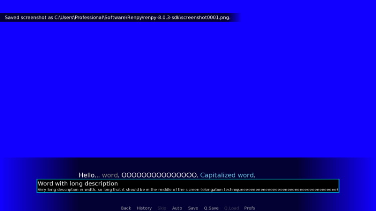
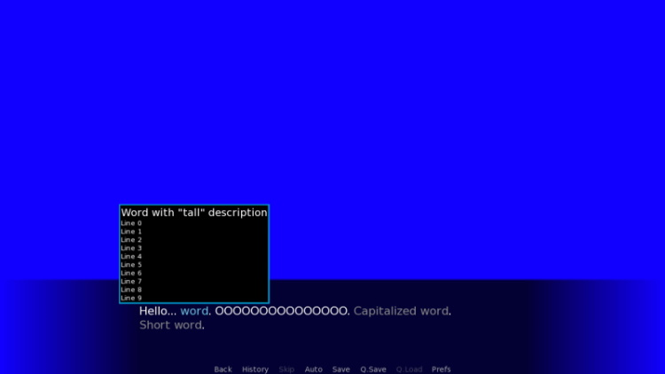
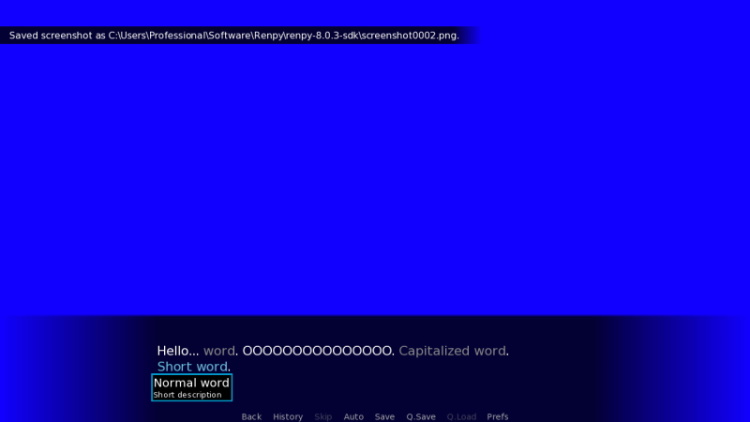

# Usage
 * Copy `game/glossary_core.rpy` to `game` folder of your project
 * Customize view of `glossary_word` and `glossary_word_frame` screens in `glossary_core.rpy` file
 * Define glossary words:
```renpy
init python:
    GlossaryWord(
        uid='unique_word_id',
        word=_('Tatakae'),
        description=_('Means fight in Japanese.')
    )
 ```
 * Use `glossary` in characters lines:
```
    eren '{glossary=unique_word_id}Tatakae, tatakae, tatakae{/glossary}.'
    hange 'Are you mad?'
```

# Screenshots




# Limitations
 * Only text can be passed inside `glossary` tag ([see this issue](https://github.com/renpy/renpy/issues/4102))